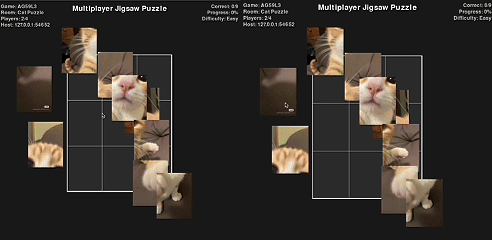

# Multiplayer Jigsaw Puzzle

## Overview

This is implementation of a multiplayer jigsaw puzzle where players collaboratively solve a puzzle. The project follows a client-server architecture - the clients are responsible for rendering the game while the server coordinates the game state (piece positions, locking and broadcasts movements so all clients stay in sync). When any player completes the puzzle, all clients are notified. Clients can host games - by providing simple information like image url, max players, difficulty level - and join games via a shared game id. The server and client communicated with a well defined JSON protocol, containing various message types and functions for (de)serialization.

<br>



<br>

[Game Demo](https://www.youtube.com/watch?v=b6uqOAH72xM)

## Gameplay

- Drag-and-drop puzzle pieces on a shared board
- Piece locking: only one player can hold (move) a piece at a time
- Smart snapping when a piece is near its correct location
- Real-time synchronization of piece positions across all clients
- The puzzle is considered complete when all pieces are placed correctly.
- When any player completes the puzzle, the server broadcasts completion and all clients show the win screen.

## Setup and Installation

This project is built with native python libraries like sockets. However, it requires some additional libaries like pygame (for frontend), pillow (for image processing) and requests (for fetching image). Make sure to have a python v3.11+ installed.

```zsh
git clone https://github.com/Nakul727/multiplayer-jigsaw.git
cd multiplayer-jigsaw
```

```zsh
python3 -m venv venv
source venv/bin/activate
python3 -m pip install -r requirements.txt
```

### Project structure:

```
shared/
  ├─ protocol.py          # Message types and serialization
  └─ constants.py         # Ports, colors, sizes, difficulty presets
server/
  ├─ main.py              # Server entry point
  ├─ server.py            # Socket accept loop and message routing
  └─ game_room.py         # Room state (players, locks, piece positions)
client/
  ├─ main.py              # Client entry/launcher
  ├─ game_gui.py          # Pygame GUI and game logic
  ├─ network_manager.py   # TCP client and handlers
  └─ puzzle.py            # Puzzle image slicing and piece metadata
```

### Running the Game

Server can be run independently on any computer. To start the server:
```zsh
python server\main.py
```
This will provide you with a the loopback and local IP address. Note: You can only connect to the server via local machine or LAN. To connect remotely, we would need to host the server.

<br>

To host a game:
```zsh
python client\main.py 127.0.0.1 5555 <game_name> <max_players> <image_url> <difficulty>

# Example
python3 client/main.py 127.0.0.1 5555 host "Cat Puzzle" 4 "https://i.pinimg.com/1200x/97/c3/e0/97c3e03d8bc65b3f277908c07289141f.jpg" easy
```

This will return a game Id that you can use to join a game.
To join a game:

```zsh
python3 client/main.py 127.0.0.1 5555 join <game_id>

# Example
python3 client/main.py 127.0.0.1 5555 join 2YH5WB
```

## Code Snippets

Includes socket opening/closing and handling of mutex-locked object.

#### Server Socket Management (`server/server.py`)

class Server:

```python

    def start(self):
        self.server_socket.bind((self.host, self.port))
        self.server_socket.listen()
        print(f"Server listening on {self.host}:{self.port}")
        self.is_running = True
        try:
            while self.is_running:
                conn, addr = self.server_socket.accept()
                t = threading.Thread(target=self.handle_client_connection, args=(conn, addr), daemon=True)
                t.start()
        finally:
            self.shutdown()

    def shutdown(self):
        self.is_running = False
        try:
            self.server_socket.close()
        except Exception:
            pass
```

#### Client Socket Management (`client/network_manager.py`)

```python

    def connect(self, ip, port):
        try:
            self.sock = socket.socket(socket.AF_INET, socket.SOCK_STREAM)
            self.sock.connect((ip, port))
            self.connected = True
            threading.Thread(target=self._listener_loop, daemon=True).start()
            return True
        except Exception as e:
            print(f"Connection failed: {e}")
            self.close()
            return False

    def close(self):
        self.connected = False
        if self.sock:
            try:
                self.sock.close()
            finally:
                self.sock = None
```

#### Locked Object Handling (`server/game_room.py`)

```python
class GameRoom:
    def __init__(self, ...):
        self.locked_objects = {}
        self.piece_positions = {}

    def lock_object(self, object_id, client_address):
        if not object_id:
            return False, {'error': 'Missing object_id'}
        if object_id in self.locked_objects:
            return False, {'error': f'Object {object_id} is already locked'}
        
        self.locked_objects[object_id] = client_address
        return True, {'message': f'Object {object_id} locked'}

    def release_object(self, object_id, client_address, position):
        if not object_id or position is None:
            return False, {'error': 'Missing object_id or position'}
        if self.locked_objects.get(object_id) != client_address:
            return False, {'error': f'Object {object_id} not locked by you'}
    
        # Remove from locked objects
        del self.locked_objects[object_id]
        
        # Update piece position in server state
        self.update_piece_position(object_id, position)
        return True, {'message': f'Object {object_id} released'}
```

### Group Members

This project was made for CMPT 371: Data Communication and Networking, Summer 2025, SFU. 

Below are the names and corresponding github usernames:

- Nakul Bansal (Nakul727)
- Ruiyang Wu (Brady666-777)
- Raghav Ahuja (raghavahuja2801)
- Jonathan Goh (goldfish047)